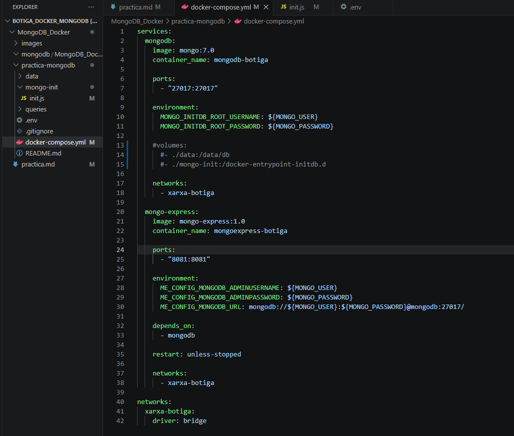
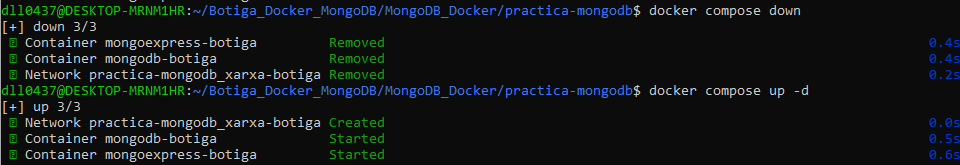
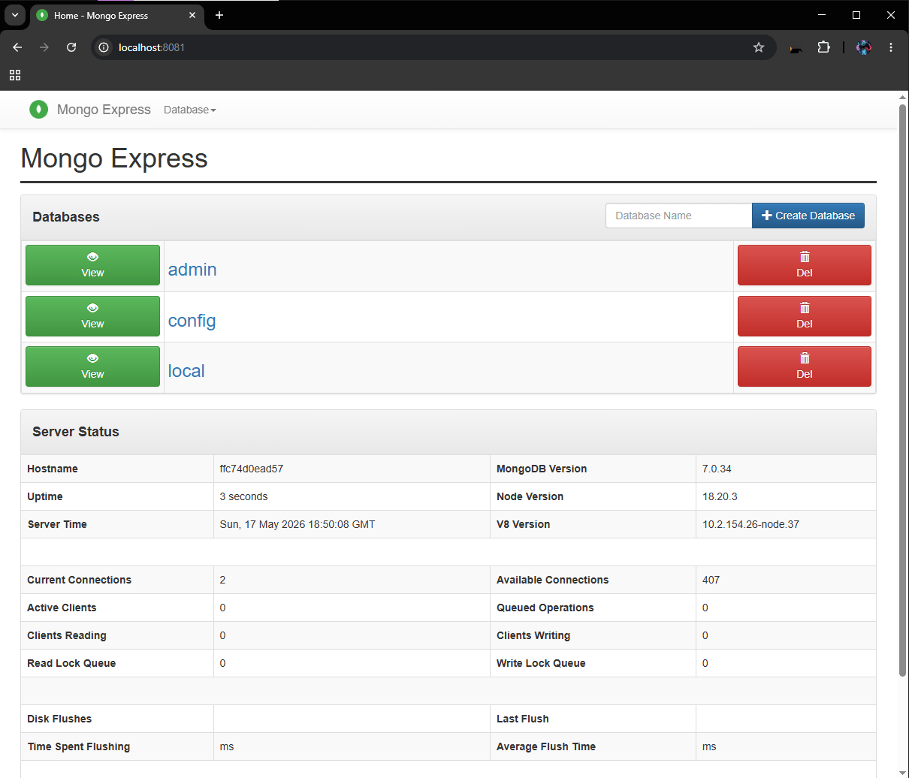

# Preguntas
## Bloc 1
**1. Quina és la diferència entre docker run i docker compose up?<br>**
La diferencia entre los dos es que docker run crea el servicio, por ejemplo de MongoDB, manualmente y lo ejecuta. Puedes indicarle diferentes opciones como **-p** para el puerto o **-d** para segundo plano. Comparándolo con docker compose, utilizas un archivo llamado docker-compose.yml, en el cual puedes poner múltiples servicios como el MongoDB y el Mongo Express, para poder ejecutarlo y levantar esos dos servicios automáticamente con un solo comando.

En resumen, docker run es más simple para levantar un solo servicio (se pueden varios, pero es más complejo) y poder ejecutarlo, comparado con docker compose, que puede levantar varios servicios automáticamente y ejecutandolo con un solo comando.


**2. Per a què serveix la instrucció depends_on?<br>**
La instruccion depends_on indica que se debe iniciar cuando el otro contenedor haya arrancado. Por ejemplo, si Mongo Express depende de MongoDB, Mongo Express no se iniciará hasta que MongoDB haya arrancado.

**Garanteix que el servei dependent estigui completament operatiu<br>**
No, no lo garantiza. Mientras el servicio esté arrancado, el otro contenedor puede iniciarse, aunque no este completamente listo.

**3. Explica quina és la diferència entre una xarxa bridge per defecte i una xarxa personalitzada (amb nom) a Docker Compose.<br>**
La diferencia entre los dos es que bridge es una red automática que, para comunicarse, utiliza IP y tiene menos control sobre las redes. Comparado con una red personalizada, esta puede comunicarse mediante los nombres de los contenedores y es más ordenada a la hora de gestionar las redes.

## Bloc 2
**1. Què passaria si no definíssim cap volum al docker-compose.yml? Fes la prova i documenta el resultat.**<br>
Lo que pasaria es que al reiniciar el mongodb, se borrarian esos datos de manera permanente y al no tener volumenes que tenian esos datos guardaos, se inicia sin datos.

**Prueba:**<br>
- Primero lo que hice fue poner en comentarios los volumentes:



- Luego utilizamos este comando para eliminar los contenedores:
```
docker compose down
```
- Después utilizamos este comando para volver a crear los contenedores sin los volúmenes ya que los comentamos:
```
docker compose up -d
```



- Comprobamos entrando a Mongo Express viendo si la Base de Datos de botiga esta o no.
    - En este caso no aparece, ya que los datos no se guardan en ningún lugar sin volúmenes y al reiniciar esos datos se pierden.


**2. Explica la diferència entre un volum named (amb nom) i un bind mount (ruta del host). Quan convé usar cada un?**<br>
Un volumen named es una carpeta que Docker crea y gestiona él mismo en su zona privada con el nombre que tú le des.
Un bind mount es una carpeta de tu propio ordenador que tú eliges y conectas directamente al contenedor con Docker.

**3. Explica la diferència entre l’estratègia embedding i l’estratègia referència amb exemples. Cal que els exemples siguin diferents dels que s’exposen en aquest document.**<br>
La diferencia es que en la estrategia embedding se guardan todos los datos relacionados dentro del mismo documento, mientras que en la estrategia de referencia los datos se separan en diferentes documentos y se conectan mediante un identificador (ID).

- **Estrategia embedding**
{
  "nombre": "Ana",
  "direcciones": [
    { "ciudad": "Barcelona", "calle": "Carrer Major 10" }
  ]
}

- **Estrategia referencia**
```
{
  "_id": 1,
  "nombre": "Ana",
  "direccion_id": 101
}
```

```
{
  "id": 101,
  "ciudad": "Barcelona",
  "calle": "Carrer Gotic 20"
}
```

**4. Explica quina estratègia o estratègies has fet servir en la col·lecció comandes i per quin motiu.**<br>
Lo que yo utilice fue las dos estrategias ya que puse todos los datos en un mismo documento pero también hago la rederencia al producto y al cliente.